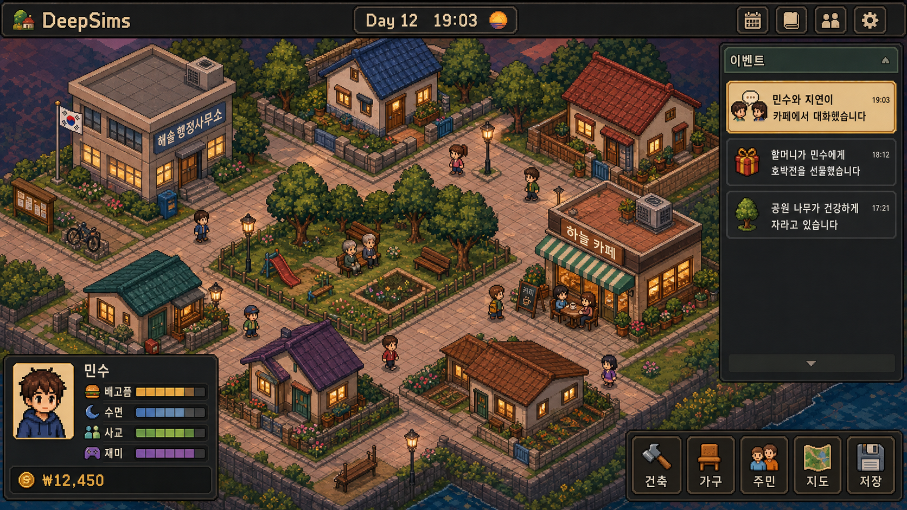

# DeepSims

2D 쿼터뷰(아이소메트릭) 심즈라이크 라이프 시뮬레이션. **접속하지 않아도 세계가 계속 흘러갑니다** —
24시간 서버가 아니라 *결정적 따라잡기 시뮬레이션*(시간의 지연 평가)으로, 다시 접속하면 그동안
심들이 살아온 이야기를 부재중 리포트로 받아봅니다.


*(목업 이미지 — 실제 게임 화면은 개발 중)*

## 특징

- **오프라인 세계 진행**: 서버가 꺼져 있던 시간만큼 접속 시 빨리감기로 따라잡기. 같은 시드 + 같은
  입력이면 언제 어떻게 나눠 실행해도 결과가 완전히 동일한 결정적 시뮬레이션.
- **논문 기반 에이전트 인지**: Stanford *Generative Agents*(Smallville)의 기억 스트림·회고·하루 계획·
  정보 확산 아키텍처를 LLM 없이 정수 규칙 연산으로 이식. 심들은 특성(성별·나이·MBTI·직업)·기분·
  기억·관계·습관에 따라 스스로 판단하고, 왜 그렇게 행동했는지 사유가 기록됩니다.
- **전부 로컬**: Node 서버 + SQLite 파일 + 브라우저 클라이언트. 외부 서비스·API 키 불필요.
- 도트그래픽 아트 (Codex imagegen 생성).

## 설치 및 실행

요구사항: Node.js ≥ 20, npm

```bash
git clone https://github.com/devdongin/DeepSims.git
cd DeepSims
npm install
npm start
```

브라우저에서 `http://localhost:3000` 접속.

서버를 종료해도 세계는 "흘러갑니다" — 다시 `npm start` 하면 그동안의 시간을 따라잡고,
접속 시 부재중 리포트를 보여줍니다. 모든 데이터는 로컬 `deepsims.db` 파일 하나에 저장됩니다.

**초기화**: 세계를 처음부터 다시 시작하려면 서버를 끄고 `deepsims.db*` 파일을 삭제하세요.
**다른 시드**: `DEEPSIMS_SEED=12345 npm start`
**손상 복구**: 부팅 시 손상이 감지되면 서버가 안내와 함께 정지합니다. 직전 체크포인트(snapshot
id=2)로 되돌리려면 서버를 끄고 아래를 실행하세요 — **직전 체크포인트 이후의 역사(이벤트·그
구간에 적용됐던 지시)는 소실되며**, 재시작 시 그 구간을 따라잡기로 새로 살아냅니다:

```bash
sqlite3 deepsims.db "
UPDATE snapshot SET tick=(SELECT tick FROM snapshot WHERE id=2), state=(SELECT state FROM snapshot WHERE id=2) WHERE id=1;
UPDATE meta SET value=(SELECT tick FROM snapshot WHERE id=1) WHERE key='lastSimulatedTick';
DELETE FROM events WHERE tick > (SELECT tick FROM snapshot WHERE id=1);
DELETE FROM inputs WHERE applied=0 AND target_tick <= (SELECT tick FROM snapshot WHERE id=1);"
```

이미 적용(applied=1)됐던 지시는 되돌리지 않습니다(과거는 다시 쓰지 않음 — 그 효과만 스냅샷과
함께 사라집니다). 미적용 지시 중 과거를 타깃하게 된 것은 삭제됩니다.

**LLM 이슈 리뷰(선택)**: 저장소 Settings → Secrets에 `ANTHROPIC_API_KEY`를 넣으면
`needs-llm-review` 라벨이 붙은 이슈를 Claude가 자동 분석해 코멘트로 로직 수정안을 제안합니다.

## 프로젝트 상태

- [x] 기획서 (Claude ↔ Codex 교차 검증, [PLAN.md](PLAN.md))
- [x] Phase 1: 결정적 코어 루프 (욕구·유틸리티 AI·예약·따라잡기·영속화·클라이언트)
- [x] Phase 2: 특성(성별·나이·MBTI·직업)·기분 + 플레이어 온보딩 + **핫스왑 판단 로직**
      (`logic/params.json`을 고치면 실행 중인 세계가 다음 틱부터 새 규칙으로 삽니다)
- [x] Phase 3: 기억 스트림·검색·회고·관계 티어·습관 (Generative Agents 아키텍처의 결정적 이식)
- [x] Phase 4: 하루 계획·정보 확산·모임 공지 (파티 확산 실험 재현 — 소문이 입소문으로만 퍼져
      몇 명이 모이는지는 창발적 결과)
- [x] 도트 캐릭터 스프라이트 (Codex imagegen)
- [x] 로드맵 (§15): 대처 행동(스트레스에 음주🍺·폭식·은둔·운동 — 성격이 대처 방식을 결정하고
      반복하면 습관·중독으로 창발), 건설(자주 다니는 길이 도로가 되고, 집이 좁으면 침대를 증축),
      사고 흐름 추적(왜 그 행동을 했고 무엇이 막혔는지가 피드에 표시)
- [x] 해솔마을 세계관 (§16): 도서관·시장·낚시터·술집, 장보기→집밥 경제, 날씨(비 오면 실내로),
      길에 떨어지는 동전, **진짜 내용이 있는 대화**("서연이랑 요즘 친해졌어", "마감이 코앞인데
      잠이 온다" — 기억·관계·직업·날씨가 말이 된다)
- [x] 사회 시뮬레이션 (§17): **512×512** 맵, **이민**(주거가 늘면 새 주민이 온다),
      직업·회사 다양화(병원 의사·시청 공무원·학교 교사·카페 바리스타), **질병과 전염**(사교가
      감기를 옮긴다, 병원 진료), **선거와 시장**(인기 = 사람들의 호감 — 상호작용이 권력을 만든다),
      **연애·결혼·파혼**(회고에서 싹트고, 결혼하면 합가), **동아리**(습관이 모임이 된다),
      **험담의 사회적 영향**(말이 청자의 관계 인식을 실제로 바꾼다), 결혼식 마을 잔치,
      선거 유세(인기인이 거리로 나선다), 새해·졸업·은퇴의 생애 주기, 식당·헬스장·영화관
      (비 오는 날의 실내 피난처), 90일마다 열리는 마을 축제 🏮
- [x] 자율 세계 확장 (§16.5/16.6): 빈 공터 96곳 — 침대가 모자라면 심들이 스스로 공사를
      벌여 **새 집·카페·공원을 짓고**, 완공되면 과밀한 집에서 이사까지 갑니다. 마을이 자랍니다.

## 플레이 방법

1. 접속하면 **당신의 배경**(이름·성별·나이·MBTI·직업)을 입력합니다 — 당신을 닮은 심이 마을에 이사 옵니다.
2. 심을 클릭하면 욕구·기분·성격·판단 사유가 보이고, 행동을 지시할 수 있습니다.
3. 상단 **📣 모임 공지**로 파티를 열어보세요 — 소문은 심들의 수다를 통해서만 퍼집니다.
4. 서버를 꺼도 세계는 흘러갑니다. 다시 켜면 부재중 리포트가 그동안의 이야기를 들려줍니다.
5. 심들이 이상하게 행동하나요? `logic/params.json`의 수치를 고쳐보세요 — 저장 즉시 적용됩니다.

## 특이사항 제보 → 로직 진화

심이 이상하게 행동하나요? 시뮬레이션이 결정적이라 **시드 + 게임 시각만 있으면 완전 재현**됩니다.
[특이사항 이슈](../../issues/new?template=anomaly.md)로 올려주시면 LLM 교차 리뷰(Claude 설계 ↔
Codex 검증)를 거쳐 판단 로직이 지속적으로 개선됩니다. 규칙 개선 아이디어는
[로직 개선 제안](../../issues/new?template=logic-proposal.md)으로.

## 개발 방식

Claude Code(설계·구현)와 OpenAI Codex(검증·리뷰·이미지 생성)의 듀얼 AI 루프로 개발합니다.
기획서는 두 AI의 교차 리뷰로 합의된 버전만 반영됩니다 (`docs/` 및 codex_review_*.md 참조).

## 라이선스

MIT
